# School_District_Analysis

# Overview of the School District Analysis: 
The purpose of this project is to analyze district-wide standardized test results. Data is aggregated to show trends in school performance. Analysis was performed using School and Student Data. The school board will be using these results to make strategic decisions regarding future school budgets and priorities.

# Project Description:
This project uses the Pandas library to manipulate data into tables that allow for aggregating and summarizing of district and school data. Array calculations are performed to create a snapshot of school district's key metrics. Analysis done to show trends such as top peforming schools, bottom performing schools, math and reading scores by grade, and scores by school spending, size, and school type.

## Results:

### District Summary 

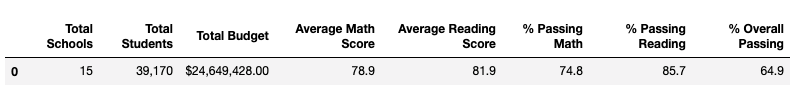

### School Summary Affected Before:

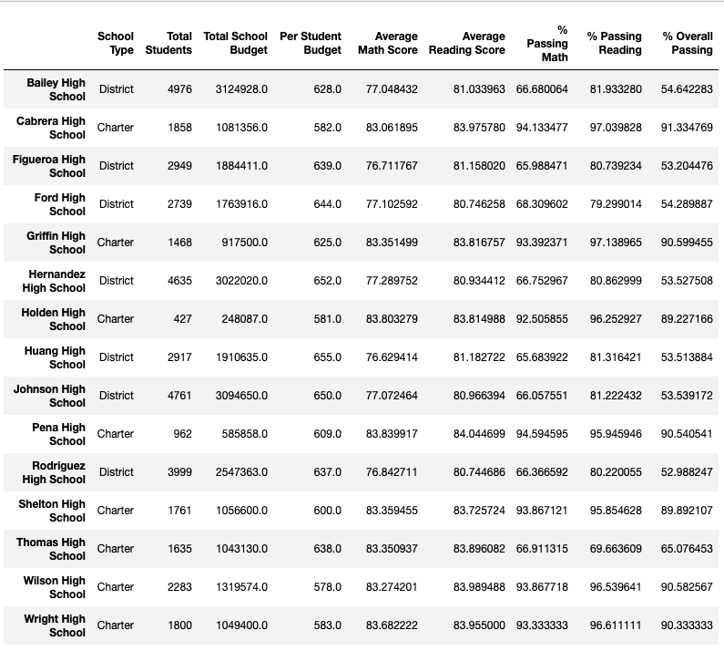

### School Summary Affected After:

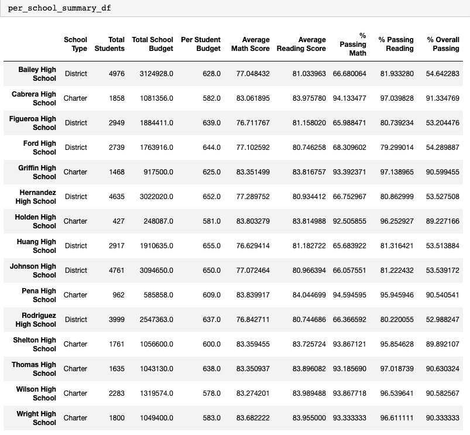

### Replacing Ninth Grade Math Scores:
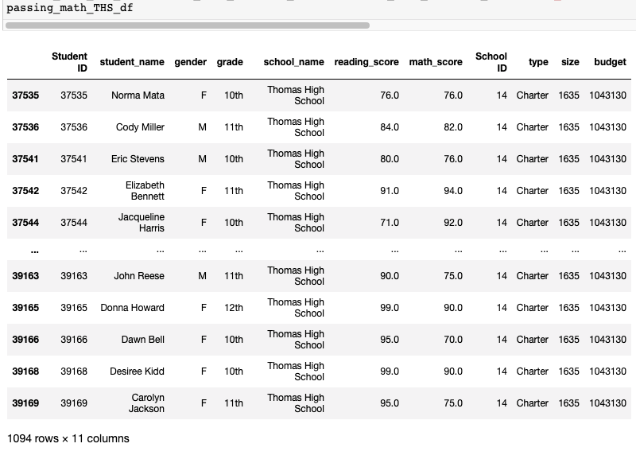

### Replacing Ninth Grade Reading Scores:
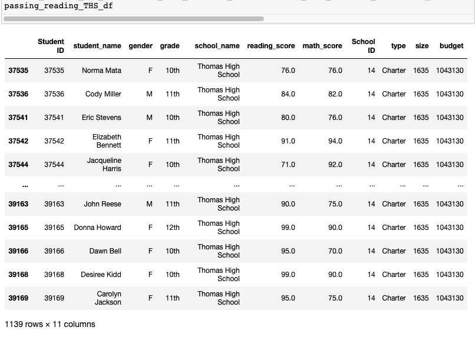

### Replacing Ninth Grade Math -Reading Scores:

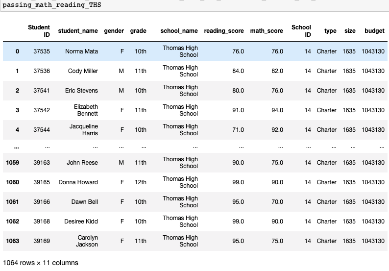

### Top-Five Schools:
  - The top 5 schools are all charter schools.
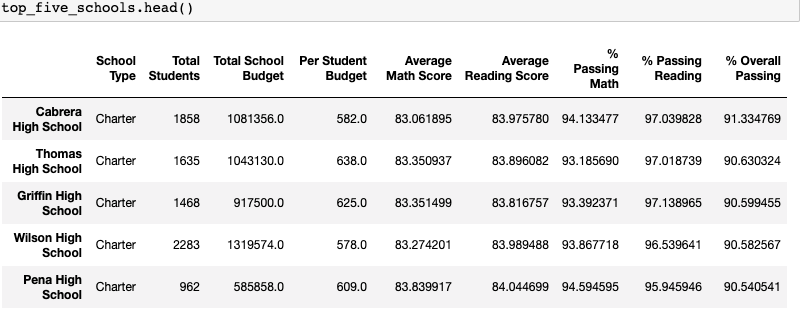

### Bottom-Five Schools:
  - The Bottom 5 schools are all District schools.
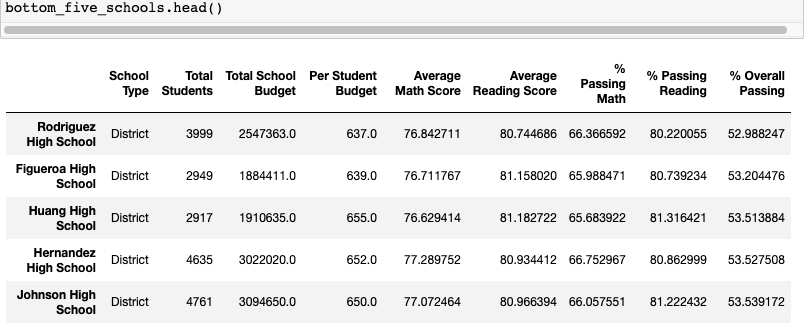

## Average math and reading scores stay consistent across grade level when grouped by school. There is no major improvement in scores from any school.

  - ### Math scores by grade

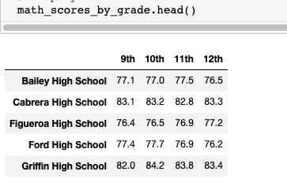
    - ### Reading scores by grade
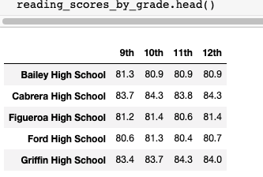

### Scores by school spending
  - As a whole, schools with higher budgets, did not yield better test results. By contrast, schools with higher spending per student actually ($645-675) underperformed compared to schools with smaller budgets (<$585 per student).
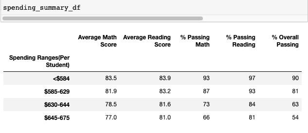

### Scores by school size
  - As a whole, smaller and medium sized schools dramatically out-performed large sized schools on passing math performances (89-91% passing vs 77%).

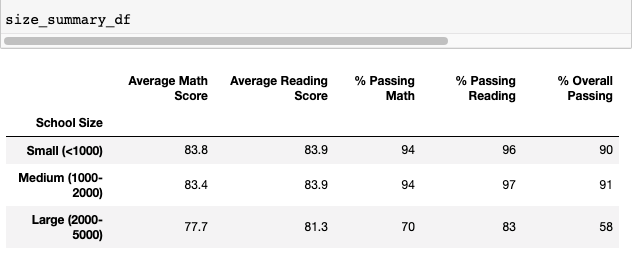

### Scores by school type
  - As a whole, charter schools out-performed the public district schools across all metrics. 
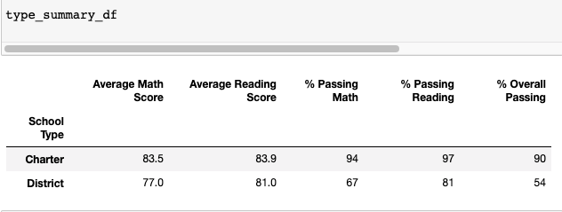
## Summary: 

  
  - However, more analysis will be required to extract from various sources if the effect is due to school practices or the fact that charter schools tend to serve smaller student populations per school.
  - Math passing rates are always consistently lower across every metric, but the difference between math and reading passing rates is greater amoung lower performing schools, large schools, and higher spending per student which all seem to correlate.
  - In general (one exception), per student spending is higher in bottom performing schools than top performing.
  - Schools under 2000 students have much higher passing rates than those with student populations above 2000. A comparision of 95 to 75%. The same phenomenon is seen with high and low per student spending brackets and district versus charter schools

